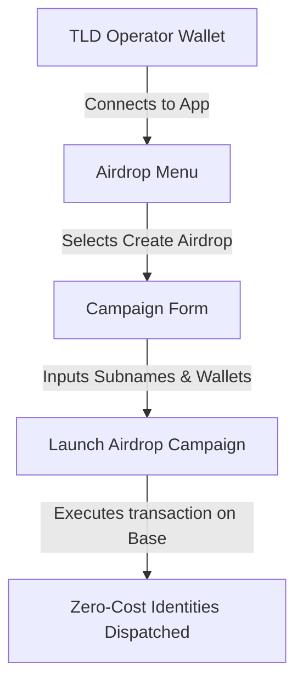

# Creating Airdrops (Create Airdrop)

The **Airdrop** menu in the DScroll App is an invaluable portal for community builders. The **Create Airdrop** module enables TLD operators to easily configure and execute direct identity distributions.

---

## 🛠️ Accessing the Airdrop Creator

To access the configuration screen:
1. Connect the wallet holding the master TLD NFT to the DScroll App.
2. In the navigation sidebar, select the **Airdrop** primary menu.
3. Click the **Create Airdrop** action button.

---

## 📝 Configuring the Airdrop Campaign

The **Create Airdrop** portal guides operators through a structured campaign setup:

### 1. Select Target TLD
Choose which of your owned Top-Level Domains you want to distribute subnames under (e.g., if you own `@mango` and `@store`, select the target namespace).

### 2. Enter Recipient Allocations
Specify the exact sub-names and recipient wallets:
* **Single Dispatch**: Enter one subname (e.g., `moderator`) and one destination wallet address.
* **Bulk Dispatch (Optional)**: If supported by the white-label deployment, upload or input a comma-separated list of addresses and usernames to queue multiple transfers.

---

## 🚀 Dispatching the Identities

Once you have verified the recipient list and corresponding subnames:

1. Click **Verify & Prepare Airdrop**.
2. The DScroll App will validate that:
   * None of the requested sub-names are already registered.
   * All recipient addresses are valid Web3 addresses.
3. Click **Execute Airdrop**.
4. **Approve Gas Transaction**: Your wallet will prompt you to approve the `directMint` transaction. Because you are the sovereign owner of the TLD registry, you bypass standard registration costs entirely, paying **only network gas fees** (often less than a cent on the Base network).
5. Once confirmed on-chain, the sub-name NFTs are minted and instantly dropped into the recipients' wallets.
