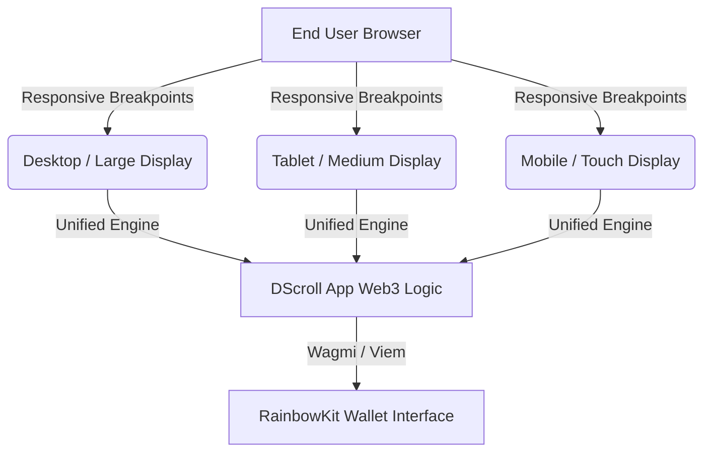

# Architecture & Technical Stack

The DScroll App is engineered using a modern, lightweight, and high-performance Web3 front-end stack. It provides a production-ready foundation designed for developer customization and rapid scaling.

---

## 🛠️ Core Technology Stack

The white-label portal is built with the following primary components:

* **Framework**: [Next.js](https://nextjs.org/) (React) — leveraging optimized client-side rendering and fast static page routing.
* **Styling**: Vanilla CSS with custom design tokens — ensuring a lightweight footprint with high visual flexibility and seamless mobile/desktop responsiveness.
* **Web3 Connections**: [RainbowKit](https://www.rainbowkit.com/) combined with [Wagmi](https://wagmi.sh/) and [Viem](https://viem.sh/) — providing an elegant, highly polished wallet connection interface out of the box.

---

## 🔗 RainbowKit Wallet Integration

To offer a premium onboarding experience, DScroll App integrates **RainbowKit**, the industry standard for Web3 wallet connectivity:

* **Supported Wallets**: Supports all major wallets natively including MetaMask, Coinbase Wallet, Rainbow, Rabby, Trust Wallet, Uniswap Wallet, and hardware integrations like Ledger.
* **Network Enforcement**: Automatically prompts users to switch their network if they connect to an unsupported chain (e.g., prompting a switch to Base Mainnet).
* **Elegant UI Customization**: Operators can easily toggle dark mode, light mode, or customize the color themes of the connection modal to match their custom brand styling directly from their environment variables.

---

## 📱 Fully Responsive Design

Identity management happens on the go. The DScroll App is coded from the ground up to be **fully responsive**:

* **Fluid Grid System**: Adapts seamlessly from massive desktop monitors down to standard smartphone screens.
* **Touch Optimization**: Smooth button heights, readable spacing, and micro-animations designed for mobile web browsers.
* **Adaptive Modals**: All identity management screens, airdrop setups, and profile configurations resize dynamically to prevent horizontal scrolling or layouts breaks.

---

## ⚡ Direct Contract Resolution

The application communicates directly with on-chain DScroll smart contracts using optimized JSON-RPC endpoints:
* **Zero Middlemen**: No centralized database is required to search for name availability. The app queries the blockchain directly.
* **Fast Response**: Search results are retrieved in milliseconds, ensuring a highly responsive user experience.
