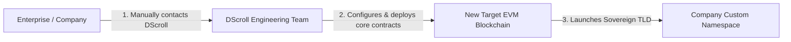

# Enterprise Network Expansion

DScroll is built with a highly modular, multi-chain capable contract architecture. While standard instances are deployed on Base Mainnet, DScroll is engineered to expand to new networks to meet corporate and enterprise requirements.

---

## 🏢 Custom Blockchain Support for Organizations

If your company, brand, or DAO operates on a specific Layer 1, Layer 2 scaling solution, or dedicated app-chain, you are not limited to standard deployments.

The DScroll network is fully capable of expanding and launching custom TLD registries on virtually any compatible EVM (Ethereum Virtual Machine) blockchain network.

---

## 🛠️ Deployable Infrastructure

When expanding to a new blockchain network, the DScroll engineering team deploys the complete suite of sovereign naming resources:
1. **TLD Registry Smart Contracts**: Optimized, secure ERC-721 registries and reverse resolvers deployed on the target chain.
2. **Branded Manager Dashboard**: Enabling you to manage your pricing, locking, and metadata directly on the new network.
3. **White-Label Portal Deployment**: Seamless integration of the new network chain parameters into the Next.js registrar template (Wagmi, Viem, and RainbowKit).

---

## 📞 How to Request Network Expansion

If you need a dedicated TLD registry on a new network:

* **Contact the DScroll Team**: Reach out directly to the DScroll core developers or community leads via official communication channels (GitHub, Discord, or Twitter/X).
* **Manual Setup & Auditing**: The engineering team will manually evaluate the target network parameters, deploy the registry, and assist your developers in mapping your custom `.env` variables to the new network contract addresses.
