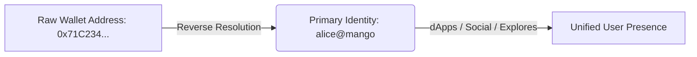

# Primary Identity Setup

The **Primary Identity** configuration is a core feature of the **My Names** dashboard. It empowers users to select their default human-readable username to represent them across the entire Web3 ecosystem.

---

## 🔍 What is a Primary Identity?

In raw blockchain interactions, you are identified by a 42-character hexadecimal wallet address (e.g., `0x71C234E56789...`). While highly secure, these addresses are impossible for humans to memorize or read confidently.

By setting a **Primary Identity** (e.g., `alice@mango`), you establish a global on-chain username:
* **Reverse Resolution**: Mapped dApps and block explorers query the registry to display your beautiful human-readable handle (like `alice@mango`) instead of your raw hex wallet address.
* **Unified Social Profile**: Act as a cohesive, recognizable digital citizen across Web3 social layers, chat rooms, and portfolio trackers.

---

## 🛠️ How to Configure Your Primary Identity

Users can easily set their default username directly from the registrar's frontend:

1. Connect your wallet to the DScroll App (e.g. `app.dscroll.com` or your custom white-label portal).
2. Navigate to the **My Names** menu tab.
3. The dashboard will list all sovereign sub-names currently owned by your connected wallet.
4. Locate the sub-name you wish to set as your primary handle.
5. Click **Set as Primary**.
6. **Wallet Transaction**: This will trigger an on-chain transaction that updates your wallet's reverse-record pointer in the main DScroll Registry contract.
7. Approve the gas fee, and once confirmed, your selected name becomes your official Web3 primary handle!

> [!IMPORTANT]
> A wallet can only have **one** Primary Identity active at any given time. If you decide to set a new name as your primary handle, your previous reverse-mapping record is automatically overwritten.
