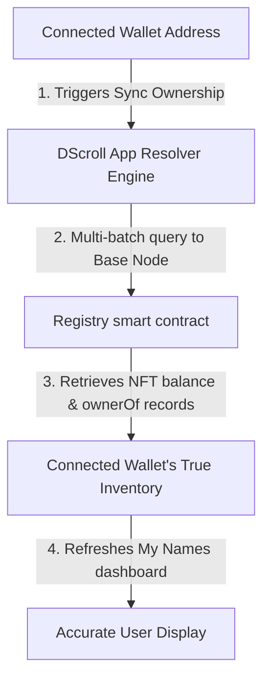

# Sync Ownership State (Sync Ownership)

To ensure that your personal dashboard remains perfectly aligned with the blockchain, the **My Names** panel features a dedicated **Sync Ownership** utility.

---

## 🔍 Why Sync Ownership is Necessary

When you buy, mint, or edit names directly within your white-label registrar site, the application instantly updates its internal cache. 

However, there are several external scenarios where ownership records can change outside of the local interface:
* **Secondary Marketplace Trading**: You purchase or sell a sub-name NFT on external platforms (like OpenSea, Element, or Blur).
* **Direct Wallet-to-Wallet Transfers**: A friend sends a DScroll sub-name NFT directly to your public address using a wallet transfer button.
* **Smart Contract Interactions**: An advanced developer interacts directly with the contract functions on BaseScan to transfer registry keys.

In these cases, your connected browser needs to force-query the blockchain to recognize that your wallet's asset inventory has changed.

---

## ⚙️ How the Sync Ownership Engine Works

The **Sync Ownership** button triggers a direct, multi-query scan of the blockchain:

---

## 🛠️ How to Sync Your Name Inventory

If you have recently acquired a name externally and do not see it in your dashboard:

1. Open the DScroll App and connect your wallet.
2. Navigate to the **My Names** menu tab.
3. Click the 🔄 **Sync Ownership** button located at the top of the name list.
4. The system will perform a real-time, on-chain lookup of all sub-name NFTs associated with your public key.
5. Within seconds, your inventory view will refresh to display any newly imported or transferred names.
