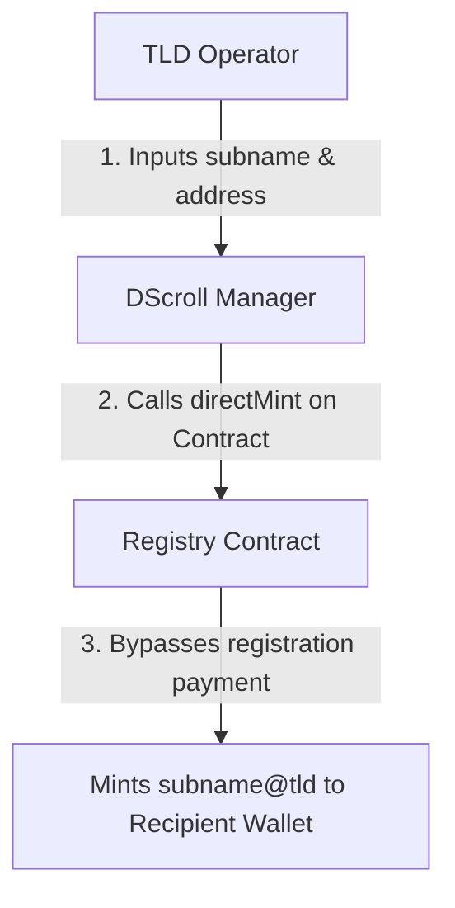

# Community Airdrops & Rewards

Building an active, engaged community is the primary goal of any naming network. DScroll equips TLD owners with powerful tools to coordinate sub-name **Airdrops** and community rewards.

---

## 🎁 What is a Naming Airdrop?

An **Identity Airdrop** allows you, the TLD owner, to mint specific sub-name identities (e.g., `vip@brand`, `founder@brand`, `dev@brand`) and deposit them directly into the wallets of community members, fans, or team members at **zero cost** to the recipient.

Because you are the sovereign owner of the registrar, you bypass standard registration payment logic when deploying these direct mints.

---

## 🛠️ How to Perform an Airdrop

To coordinate an airdrop campaign:

1. Connect your wallet to the **DScroll Manager** (`manager.dscroll.com`).
2. Navigate to the **Airdrops & Rewards** dashboard tab.
3. **Configure the Airdrop**:
   * Enter the desired **Sub-Name** (e.g., `moderator`).
   * Enter the recipient's **Target Wallet Address** (e.g., `0x71C...`).
4. **Initiate Mint**: Click **Send Airdrop**.
5. Approve the gas-only transaction in your wallet.

---

## 🚀 Strategic Airdrop Playbooks

Use airdrops to kickstart your Web3 identity community:

### 1. The Core Team Reserve
Before launching registrations to the public, mark your registry as **Inactive** and airdrop premium identities to your key team members:
* `ceo@yourbrand`
* `admin@yourbrand`
* `marketing@yourbrand`

### 2. High-Status Contributor Rewards
Reward your most active Discord moderators, top GitHub contributors, or major token holders with exclusive single-digit or status sub-names (e.g., `vip@yourbrand` or `mod@yourbrand`).

### 3. Cross-Community Partnerships
Partner with other popular projects or DAOs. For instance, if you own `@mango`, you could airdrop `juice@mango` to key founders of partner protocols to drive viral cross-promotion.

> [!IMPORTANT]
> Airdropped names are fully functional, self-custodied identities. Recipient wallets hold complete control over their sub-name NFT records and can configure their own resolved addresses.
