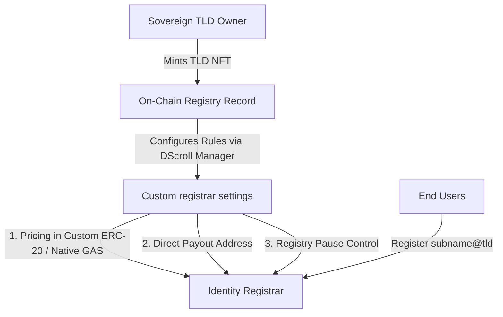

# Sovereign TLDs & Top-Level Names (TLN)

A **Sovereign Top-Level Domain (TLD)** is a fundamental paradigm shift in digital identity, moving ownership from centralized rental systems to permanent, self-custodied on-chain assets.

---

## 💡 What is a Top-Level Name (TLN)?

In the DScroll naming service protocol, a **Top-Level Name (TLN)** represents the root identifier of a sovereign namespace. Unlike traditional DNS or naming systems that treat users as renters of sub-domains (e.g., standard `.eth` sub-names), DScroll allows anyone to mint and own a complete **TLD** as an NFT.

By owning a TLD, you become a **digital identity provider**. You establish a self-contained namespace that you fully control, monetize, and govern.

---

## 🎨 The `@` Formatting Paradigm

While standard naming services rely on Web2-inspired dot-notation, DScroll establishes a modern, clean, identifier-based structure built specifically for Web3 social layers and wallet address resolutions.

| Naming System | Format Example | Ownership Model | Operator |
| :--- | :--- | :--- | :--- |
| **ENS** (Dot-Notation) | `username.eth` | Sub-domain Rental | ENS DAO |
| **DScroll** (TLN-Notation) | `username@brand` | Sovereign Web3 Identity | **You** (TLD NFT Owner) |

### Structure Breakdown: `identity@tld`
* **`identity`**: The unique sub-name registered by the end-user (e.g., `alice`, `dev`, `marketing`).
* **`@`**: The native resolution separator, replacing the traditional dot.
* **`tld`**: The root Sovereign Top-Level Domain owned by the operator (e.g., `mango`, `btc`, `base`).

---

## 🛠️ How Sovereign TLD Registries Work

When you mint a TLD, the protocol deploys a sovereign registrar entry on-chain. This grants you exclusive, permanent monopoly rights over that namespace.

> [!NOTE]
> Under DScroll's architecture, there are **no recurring annual renewal fees** for root TLDs. Once you mint a TLD, it is permanently yours until you choose to transfer or trade the underlying NFT.

---

## 🌟 Key Features of the Sovereign Model

### 1. Zero Rent, Permanent Ownership
Unlike traditional domain registrars where you lease a name annually, DScroll TLDs are owned forever. Your root registry NFT is fully self-custodied in your Web3 wallet.

### 2. Autonomous Rule-Making
As the registry operator, you define the absolute rules of your namespace:
* **Who** can register a sub-identity under your TLD.
* **What** token/gas they must pay to register.
* **How** the registration fees are routed to your designated payout wallet.

### 3. Infinite Scalability
Create thousands of branded sub-name identities (e.g., `support@brand`, `founder@brand`, `member@brand`) to build organic community ecosystems and unified Web3 identity networks.
