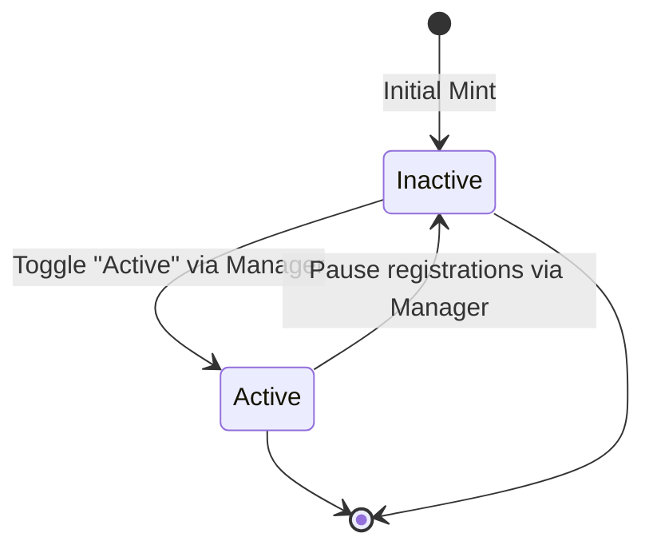

# Registry Lifecycle & Status (TLD Active)

As a Sovereign Top-Level Domain operator, you have absolute administrative control over the registration state of your namespace. The cornerstone of this administrative control is the **TLD Active Toggle**.

---

## 🟢 Understanding the Active Status

Every sovereign TLD registry has a dynamic state variable on-chain: `active` (boolean: `true` or `false`). This controls whether the general public or community members can register sub-name identities (like `user@yourbrand`) under your TLD.

### 1. Active State (`true`)
* **Behavior**: The registrar contract accepts new registration requests from anyone.
* **Use Case**: Your public white-label portal is open, your community can search for, pay, and claim custom sub-names.

### 2. Inactive State (`false`)
* **Behavior**: The registrar contract blocks all incoming public registration attempts. Currently registered identities remain unaffected.
* **Use Case**: Under maintenance, reserving private/premium names, or running a closed beta registry.

---

## 🛠️ How to Toggle Registry Status

To toggle your TLD's registration status:

1. Connect your wallet to the **DScroll Manager** (`manager.dscroll.com`).
2. Select your TLD from the dashboard.
3. Locate the **Registry Status** module.
4. Toggle the switch between **Active** and **Inactive**.
5. Approve the transaction in your wallet.

> [!WARNING]
> Setting your registry status to **Inactive** will halt all registrations across all public portals and white-label sites instantly. Be sure to notify your community in advance if you plan to conduct registry maintenance!

---

## 💡 Practical Use Cases for Inactivity

Why would a TLD owner want to mark their registry as inactive?

* **Exclusive Pre-Launches**: Keep the registry inactive while you manually mint premium names (like `ceo@brand`, `help@brand`, or `admin@brand`) for your internal team.
* **Batch Marketing Events**: Open and close registrations for seasonal campaigns (e.g., "Available only this weekend!").
* **Pricing & Token Migrations**: Pause registrations while modifying your pricing models or migrating your ERC-20 payment contract to avoid front-running.
