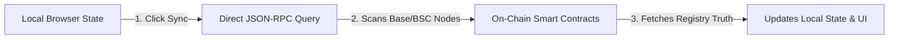

# Registry State Synchronization (Sync)

To ensure a seamless administrative experience, the DScroll Manager features a real-time **State Synchronization** engine. This engine matches your local dashboard UI with the true state of the blockchain.

---

## 🔄 Why is State Sync Necessary?

Because blockchain networks are decentralized and operate on asynchronous block times, changes made to your TLD settings (such as changing the price, updating metadata, or pausing registrations) do not reflect in standard web interfaces instantly.

Furthermore, actions performed outside the DScroll Manager (such as trading the TLD NFT on a secondary marketplace, or manually calling contract functions via BaseScan) can cause a desynchronization between your local browser cache and the on-chain truth.

---

## 🛠️ The "Sync" Button & Engine

The **Sync** action forces a complete, deep query of the blockchain state:

### What Happens During a Sync?
When you initiate a synchronization, the DScroll Manager:
1. **Verifies Registry NFT Ownership**: Checks if the connected wallet still holds the private keys/ownership of the root TLD NFT.
2. **Refreshes Contract Rules**: Queries the registrar contract for the latest values of:
   * `active` status (registration lifecycle).
   * `price` parameters (registration costs).
   * `paymentToken` address (ERC-20 integration).
   * `payoutAddress` (commission setup).
3. **Pulls On-Chain Metadata**: Queries the latest `tokenURI` and parsing schemas to reload descriptions, logos, and portal domains.
4. **Calculates Community Statistics**: Counts total sub-identities registered under your TLD.

---

## 🚀 How to Sync Your Registry

If you notice a delay in settings updates, or have recently completed a network transaction:

1. Look for the 🔄 **Sync Now** button in the top-right corner of your DScroll Manager dashboard.
2. Click the button.
3. The dashboard will display a subtle, quick loading animation as it queries the blockchain.
4. Once completed, your dashboard is 100% up-to-date with on-chain reality.

> [!NOTE]
> Standard network updates occur automatically. However, if your internet connection experiences latency or a transaction is pending in a mempool, manually triggering a **Sync** will resolve any data discrepancy instantly.
