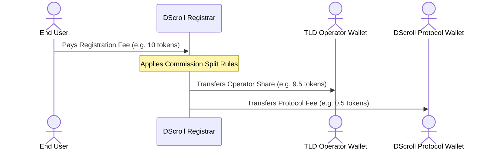

# Revenue Sharing & Commissions

With DScroll, your Top-Level Domain is not just a branding asset—it is a native revenue-generating infrastructure. The platform provides automated, on-chain royalty and fee distribution.

---

## 💸 On-Chain Revenue Flow

Whenever an end-user registers a sub-name identity under your TLD, the payment is processed directly by the smart contract registry. The revenue distribution follows strict, pre-configured rules set by the operator.

---

## ⚙️ Configuring Your Commission Payout Address

By default, all registration fees flow directly to the wallet address that holds the TLD NFT. However, you can configure a separate **Payout Address** if needed.

* **Use Cases**:
  * Routing revenue directly to a multisig wallet (like Safe) for DAO management.
  * Directing funds to a split contract to share profits among multiple co-founders.
  * Directing payouts to a cold wallet while maintaining the registry NFT in a hot wallet for configuration.

To configure your payout address:
1. Connect your wallet to the **DScroll Manager** (`manager.dscroll.com`).
2. Go to **Revenue & Payout Settings**.
3. Enter the target **Payout Address**.
4. Confirm and approve the transaction.

---

## 🎁 Secondary Royalties & Commissions

In addition to primary registration fees, DScroll is expanding to support secondary marketplace transfer royalties. When sub-names are bought and sold on secondary marketplaces (like OpenSea), the creator royalty configurations in the contract ensure that a percentage of the trade volume flows back to the TLD operator.

> [!TIP]
> Setting up a dedicated multisig (e.g., Safe) as your Payout Address is highly recommended. This ensures that your registry's revenue flows to a secure treasury managed collectively by your organization or team.
