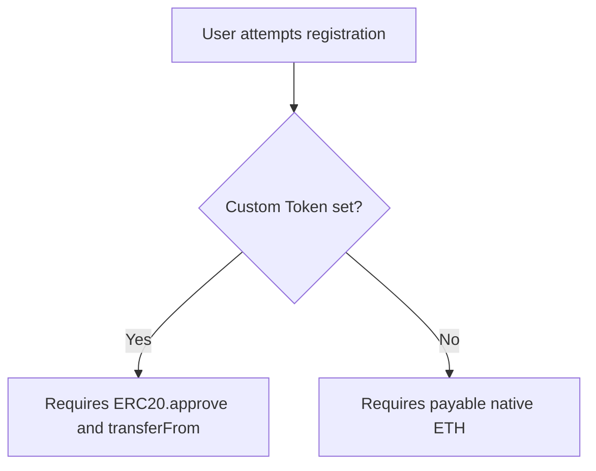

# Setting Identity Registration Prices

Pricing models are the foundation of your TLD's tokenomics. DScroll grants registry owners total control over registration costs, currency choices, and contract immutability.

---

## 💰 Flexible Currency Support

DScroll supports two payment architectures, enabling you to build natural demand for your own project tokens or collect standard gas assets:

### 1. Native Gas Token Payment (Fallback)
By default, registration fees are priced and paid in the network's native token (**ETH** on Base). 
* **Best for**: Open community platforms, simplified user onboarding (no extra tokens to buy).

### 2. Custom ERC-20 Token Integration
You can bind any valid standard **ERC-20 token contract** to your TLD registry. Once bound, the registrar contract will refuse native gas payments and require users to pay in your custom token.
* **Best for**: Projects wanting to create strong, organic utility for their native project token. To register a `username@yourproject` identity, users must purchase and spend your token.

---

## 🛠️ How to Configure Pricing & Tokens

To set your pricing rules:

1. Connect your wallet to the **DScroll Manager** (`manager.dscroll.com`).
2. Go to the **Pricing & Currency** configuration card.
3. **Select Currency**:
   * Choose **Native Token**, or
   * Choose **Custom Token** and enter the contract address (e.g., `0x123...`).
4. **Set Registration Price**: Enter the cost per identity registration (configured in standard decimals, e.g., `18` decimals for standard ERC-20s or ETH).
5. Confirm and approve the transaction.

---

## 🛡️ Sovereign Configuration Locks

To establish permanent trust with your community, DScroll features a **Sovereign Lock** mechanism.

As a registry owner, you can choose to freeze/lock the pricing configuration. Once locked:
* The registration price **cannot** be altered.
* The payment token contract **cannot** be changed.
* Your community gains ironclad assurance that their identities will never be subjected to sudden price increases or sudden policy shifts.

> [!IMPORTANT]
> Sovereign locks are **irreversible**. Once you freeze your pricing rules, even you, the TLD owner, cannot unlock them. Use this feature only when your economic model is fully proven and final!
