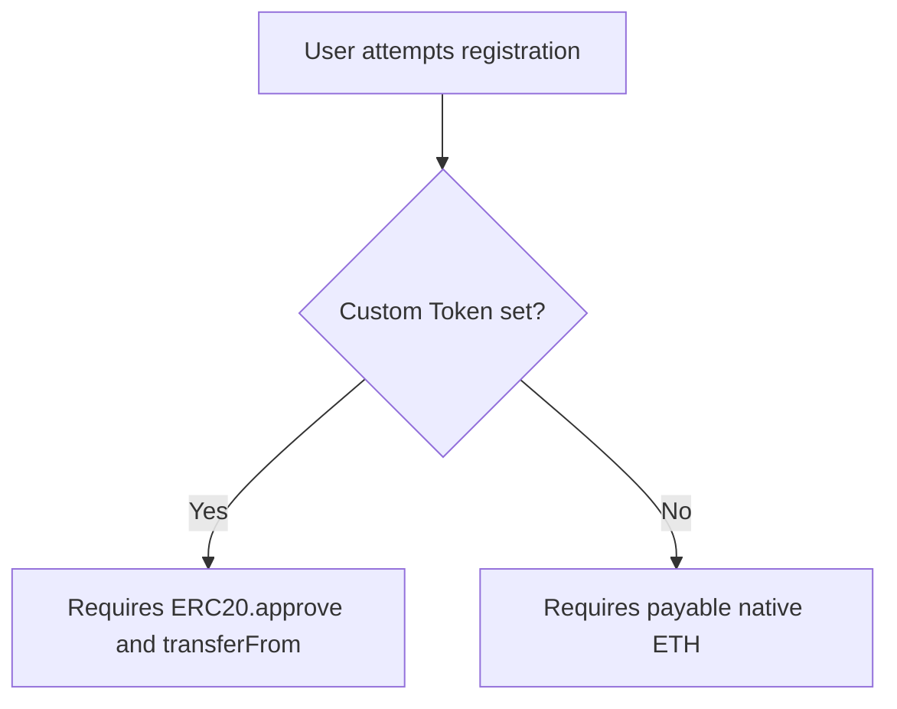

# Setting Identity Registration Prices

Pricing models are the foundation of your TLD's tokenomics. DScroll grants registry owners total control over registration costs, currency choices, and contract immutability.

---

## 💰 Flexible Currency Support

DScroll supports two payment architectures, enabling you to build natural demand for your own project tokens or collect standard gas assets:

### 1. Native Gas Token Payment (Fallback)
By default, registration fees are priced and paid in the network's native token (**ETH** on Base). 
* **Best for**: Open community platforms, simplified user onboarding (no extra tokens to buy).

### 2. Custom ERC-20 Token Integration
You can bind any valid standard **ERC-20 token contract** to your TLD registry. Once bound, the registrar contract will refuse native gas payments and require users to pay in your custom token.
* **Best for**: Projects wanting to create strong, organic utility for their native project token. To register a `username@yourproject` identity, users must purchase and spend your token.

---

## 🛠️ How to Configure Pricing & Tokens

To set your pricing rules:

1. Connect your wallet to the **DScroll Manager** (`manager.dscroll.com`).
2. Go to the **Pricing & Currency** configuration card.
3. **Select Currency**:
   * Choose **Native Token**, or
   * Choose **Custom Token** and enter the contract address (e.g., `0x123...`).
4. **Set Registration Price**: Enter the cost per identity registration (configured in standard decimals, e.g., `18` decimals for standard ERC-20s or ETH).
5. Confirm and approve the transaction.

---

## ⚙️ Configuration Adjustments

There is no configuration lock for pricing or currency on DScroll. As a TLD owner, you maintain full control and can change the payment currency and registration price at any time. 

However, once a TLD is minted, **you cannot change the blockchain where it is minted**. The underlying blockchain network is permanent and immutable for that registry.

> [!IMPORTANT]
> While you can update the pricing and currency settings on the fly, the deployment blockchain is fixed at the moment of creation and cannot be migrated to another chain.
