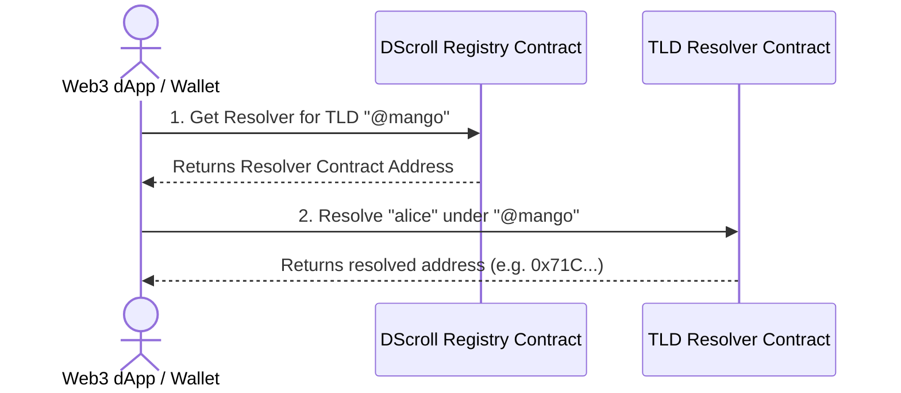

# Token URI & On-Chain Resolution

Underneath DScroll's friendly user interface lies a highly optimized, fully standard-compliant cryptographic resolution engine. This engine maps human-readable names to blockchain data using ERC-721 properties.

---

## 🔍 The Role of Token URI

In the ERC-721 (NFT) standard, the `tokenURI(uint256 tokenId)` function returns a URI pointing to a JSON metadata file describing the token.

For a DScroll Sovereign TLD, the `tokenURI` resolves to a JSON schema hosted via decentralized storage (like **IPFS**) or generated dynamically on-chain via smart contract state.

```json
{
  "name": "@mango",
  "description": "Sovereign Web3 Identity TLD on DScroll",
  "image": "ipfs://QmYwAP.../logo.png",
  "external_url": "https://manager.dscroll.com",
  "attributes": [
    { "trait_type": "Decimals", "value": 18 },
    { "trait_type": "Pricing Type", "value": "ERC20" },
    { "trait_type": "Network", "value": "Base" }
  ]
}
```

---

## ⚙️ How Resolution Works Under the Hood

When a wallet, dApp, or smart contract resolver tries to resolve a sub-identity like `alice@mango`, it performs the following on-chain workflow:



### 1. Root TLD Lookup
The resolver engine hashes the root TLD (`mango`) into its unique `uint256` Token ID using Keccak-256. It queries the main DScroll Registry to locate the owner address and active registrar contract for that TLD.

### 2. Sub-Identity Resolution
Once the registrar is located, the resolver invokes the `resolve(string subname)` function on the registrar contract. This performs a direct on-chain lookup of the mapped record:
* Returns the **Owner Wallet Address** associated with `alice@mango`.
* Returns custom text records (like email, profile details, or avatar URLs).
* Returns network-specific multi-coin mapping records.

---

## ⚡ Direct On-Chain Queries

Developers can query resolution states directly from the smart contract using standard Web3 libraries (e.g. `ethers.js` or `viem`):

```typescript
// Querying a name resolution programmatically
const resolverAddress = "0xRegistryAddress...";
const registryContract = new ethers.Contract(resolverAddress, DScrollABI, provider);

// Resolve alice@mango
const resolvedAddress = await registryContract.resolveName("alice", "mango");
console.log(`Resolved Address: ${resolvedAddress}`);
```

> [!TIP]
> Because DScroll compiles all resolution logic natively inside highly gas-optimized smart contracts, resolving names takes less than a millisecond and requires zero network requests beyond a standard Ethereum/Base JSON-RPC call.
